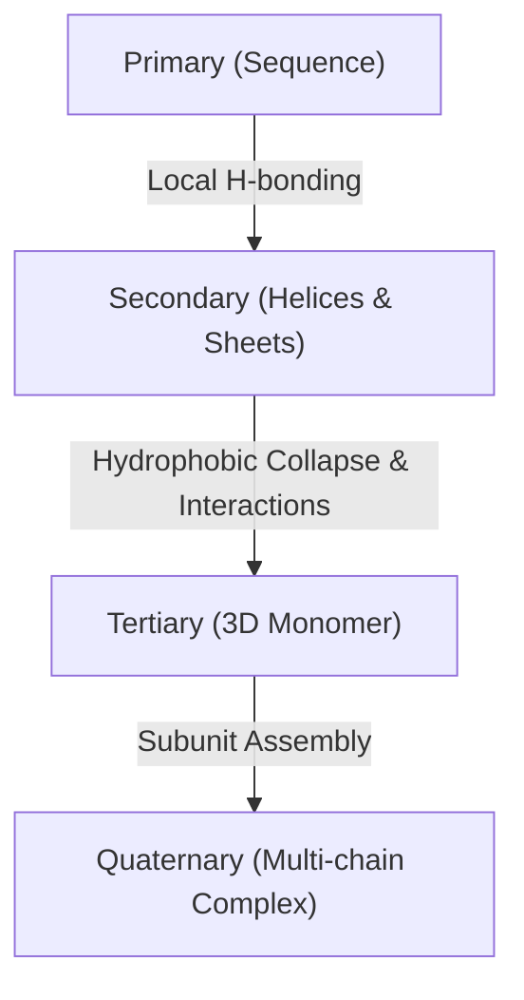

# NVIDIA BioNeMo & Protein Folding: From Zero to De Novo Design

Welcome to this 5-Lesson Learning Pack. This curriculum is designed to take you from a fundamental understanding of protein structural biology to running advanced de novo protein design pipelines using NVIDIA BioNeMo.

---

## Lesson 1: Protein Physics & The Folding Problem

Proteins are the molecular workhorses of life, orchestrating almost every biological process. To design them, we must first understand how their physical chemistry drives their three-dimensional shapes.

### The Central Dogma & Amino Acids
Proteins start as linear chains of **amino acids** translated from mRNA. Each amino acid shares a common backbone but has a unique sidechain (often designated as the **R-group**):

\[\text{H}_2\text{N}-\text{CH(R)}-\text{COOH}\]

There are 20 standard amino acids, classified by their chemical properties:
- **Hydrophobic (Apolar)**: Alanine (A), Valine (V), Leucine (L), Isoleucine (I), etc.
- **Polar (Uncharged)**: Serine (S), Threonine (T), Glutamine (Q), etc.
- **Charged**: Lysine (K+, basic), Aspartic Acid (D-, acidic), etc.

### Hierarchical Protein Structure
1. **Primary (\(1^\circ\)) Structure**: The linear sequence of amino acids linked by covalent peptide bonds.
2. **Secondary (\(2^\circ\)) Structure**: Local folding patterns stabilized by hydrogen bonds between backbone carbonyl (\(\text{C}=\text{O}\)) and amide (\(\text{N}-\text{H}\)) groups. The two major motifs are:
   - **Alpha-helices (\(\alpha\)-helices)**: Right-handed spirals.
   - **Beta-sheets (\(\beta\)-sheets)**: Parallel or anti-parallel strands.
3. **Tertiary (\(3^\circ\)) Structure**: The overall 3D folding of a single polypeptide chain, driven by hydrophobic collapse (burying apolar sidechains in the core) and stabilized by electrostatic interactions, hydrogen bonds, and covalent disulfide bridges.
4. **Quaternary (\(4^\circ\)) Structure**: The assembly of multiple folded polypeptide subunits into a functional complex (e.g., Hemoglobin).



### Anfinsen's Dogma & Levinthal's Paradox
* **Anfinsen's Dogma** states that, for small globular proteins in native physiological conditions, the 3D structure is determined solely by the primary sequence and represents the thermodynamic global minimum free energy state (\(\Delta G < 0\)).
* **Levinthal's Paradox** notes that because a polypeptide chain has an astronomical number of potential conformations (e.g., \(10^{143}\) for a 150-residue protein), folding by random sampling would take longer than the age of the universe. Yet, proteins fold spontaneously in milliseconds. This implies folding is directed along specific local energy pathways (the "folding funnel").

---

## Lesson 2: Introduction to NVIDIA BioNeMo

NVIDIA BioNeMo is a domain-specific cloud and software platform designed to accelerate digital biology and drug discovery. It hosts state-of-the-art models as optimized Microservices (NIMs) that can be run either via hosted API endpoints or deployed locally as Docker containers on NVIDIA GPUs.

### The BioNeMo NIM Architecture
NIM (NVIDIA Inference Microservice) packages models with optimized runtimes (like TensorRT-LLM and Triton Inference Server) so they can execute lightning-fast forward passes.

```
+---------------------------------------------------------+
|                  BioNeMo Client Application             |
+---------------------------+-----------------------------+
                            | (HTTP/gRPC API Call)
                            v
+---------------------------------------------------------+
|                      BioNeMo NIM                        |
|  +---------------------------------------------------+  |
|  |             Triton Inference Server               |  |
|  |  +--------------------+   +--------------------+  |  |
|  |  | TensorRT Engine    |   | PyTorch Backend    |  |  |
|  |  +--------------------+   +--------------------+  |  |
|  +---------------------------------------------------+  |
+---------------------------------------------------------+
```

### Key API Integration Patterns
To interact with BioNeMo's hosted endpoints, you authenticate using an API key (`Authorization: Bearer $NGC_API_KEY`) and communicate via JSON payloads.

> [!IMPORTANT]
> The hosted endpoint URL structure for molecular modeling is:
> `https://health.api.nvidia.com/v1/biology/{developer}/{model}/{action}`

---

## Lesson 3: Generative Backbone Design with RFDiffusion

Traditionally, protein design relied on modifying existing natural proteins. **De novo design** allows us to generate entirely new proteins from scratch to target specific shapes or receptors.

### How RFDiffusion Works
RFDiffusion is a generative model based on **Denoising Diffusion Probabilistic Models (DDPM)**. Starting from complete structural noise (randomly distributed 3D coordinates), it iteratively denoises the coordinate positions over a series of steps (typically 50) until it resolves into a clean, biologically viable protein backbone.

```
Random Noise (T=50) ===> Denoising Steps ===> Designed Backbone (T=0)
```

### The Contig DSL (Domain Specific Language)
RFDiffusion uses a specialized syntax to define what sections of a protein to generate and what parts of an existing target to keep fixed:
* `"100"`: Generate a de novo backbone of exactly 100 residues.
* `"A1-50/0 80"`: Keep residues 1 to 50 of chain A (e.g., a target receptor hotspot) and design an 80-residue binder around it separated by a chain break.

> [!TIP]
> When running de novo designs hosted on NVIDIA's API, a dummy input PDB (like a single Alanine) must be provided in the `input_pdb` payload parameter to pass endpoint validation.

---

## Lesson 4: Sequence Design via Inverse Folding (ProteinMPNN)

Once RFDiffusion outputs a 3D backbone coordinate file, we have a shape but no sequence of amino acids to make it. **ProteinMPNN** solves the "inverse folding" problem.

### Message Passing Neural Networks (MPNN)
While folding models go from Sequence \(\rightarrow\) Structure, ProteinMPNN goes from **Structure \(\rightarrow\) Sequence**. It models the protein backbone as a graph where:
* **Nodes** are the \(\text{C}_\alpha\) positions.
* **Edges** represent 3D distances and orientations between residues.

ProteinMPNN performs message passing over this graph to predict the probability distribution of the 20 amino acids at each position, generating viable sequence candidates that are thermodynamically compatible with the backbone structure.

```
Backbone Coordinates (PDB) ==> Graph Translation ==> ProteinMPNN ==> High-Scoring Sequences (.FASTA)
```

### Fine-Tuning Design Parameters
* **Sampling Temperature**: Controls sequence diversity. Low temperatures (\(T \le 0.1\)) yield highly deterministic, sequence-optimized results. Higher temperatures (\(T \ge 0.3\)) introduce sequence variation.
* **Omit Amino Acids**: You can explicitly block specific amino acids (e.g., avoiding Cysteines `"omit_AAs": ["C"]` to prevent unwanted disulfide cross-linking).

---

## Lesson 5: High-Fidelity Structure Prediction (OpenFold3 and Boltz2)

To verify if our designed sequence will fold into the target backbone shape we generated, we run forward structure prediction models. This forms an in silico validation loop.

### OpenFold3 and Boltz2
* **OpenFold3** is a fast, PyTorch-based implementation of AlphaFold3. It predicts 3D structures and confidence scores for proteins, nucleic acids, and ligands.
* **Boltz2** is a highly accurate open-source biomolecular structure prediction model optimized for multi-entity complexes and binding affinity.

### Key Validation Metrics
To evaluate if a designed protein is successful, we look at the following metrics from structure predictors:
1. **pLDDT (Predicted Local Distance Difference Test)**: A per-residue confidence score from 0 to 100.
   - \(\ge 90\): High confidence; highly structured.
   - \(70-90\): Good confidence.
   - \(< 50\): Low confidence; often disordered or unstructured.
2. **TM-Score / RMSD (Root-Mean-Square Deviation)**: Measures structural similarity between the predicted structure and the original designed backbone. An RMSD \(< 2.0\text{ \AA}\) indicates excellent structural agreement.

```
Designed Backbone (RFDiffusion)  <====== [Compare RMSD / TM-Score] ======>  Predicted Structure (OpenFold3)
             |                                                                           ^
             v                                                                           |
Designed Sequence (ProteinMPNN)  ---------------------------------------------------------+
```

### The Design Loop Summary
By combining these tools, you complete the entire computational design cycle:
1. **RFDiffusion** creates the coordinate envelope.
2. **ProteinMPNN** writes the code (sequence).
3. **OpenFold3** validates that the code compiles back into the correct shape.

### Workspace-Local Demo Loop
This repository also includes a concrete local demo loop built from the
artifacts in `outputs/`:

- [`protein_loop_system_map.md`](protein_loop_system_map.md) explains the
  current artifact set and the local loop contract.
- [`protein_loop_runner.py`](protein_loop_runner.py) is the canonical wrapper
  that ties together the backbone, sequence, alignment, fold, and feedback
  artifacts.
- [`openfold3_msa_weighting_pipeline.py`](openfold3_msa_weighting_pipeline.py)
  scores the demo alignments and writes the feedback state and run summary.

The local loop is intentionally `MOCK` / `DEMO` for the alignment assets and
heuristic feedback logic. It is designed to be reproducible, inspectable, and
easy to extend without introducing hidden autonomy.
